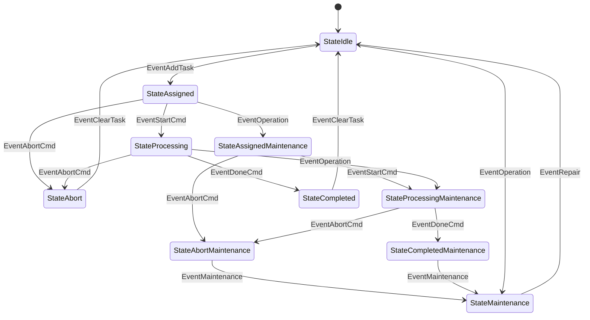

```mermaid
stateDiagram-v2
    [*] --> StateIdle
    StateAbort --> StateIdle: EventClearTask
    StateAbortMaintenance --> StateMaintenance: EventMaintenance
    StateAssigned --> StateAbort: EventAbortCmd
    StateAssigned --> StateAssignedMaintenance: EventOperation
    StateAssigned --> StateProcessing: EventStartCmd
    StateAssignedMaintenance --> StateAbortMaintenance: EventAbortCmd
    StateAssignedMaintenance --> StateProcessingMaintenance: EventStartCmd
    StateCompleted --> StateIdle: EventClearTask
    StateCompletedMaintenance --> StateMaintenance: EventMaintenance
    StateIdle --> StateAssigned: EventAddTask
    StateIdle --> StateMaintenance: EventOperation
    StateMaintenance --> StateIdle: EventRepair
    StateProcessing --> StateAbort: EventAbortCmd
    StateProcessing --> StateCompleted: EventDoneCmd
    StateProcessing --> StateProcessingMaintenance: EventOperation
    StateProcessingMaintenance --> StateAbortMaintenance: EventAbortCmd
    StateProcessingMaintenance --> StateCompletedMaintenance: EventDoneCmd
```
